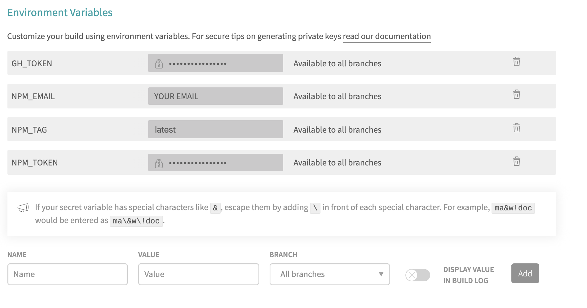

# Building CBP Theme

CBP Design System consists of the UX Guidances in the CBP Design System Guide website and the CBP Design System CSS (DS CSS). The CBP DS CSS is an npm project built and published as [cbp-ds](https://www.npmjs.com/package/cbp-ds), bundled using [Webpack 4](https://webpack.github.io/).  

## Prerequisites
1. **[Node 10 or greater](https://nodejs.org)** 
    - To run multiple versions of Node [nvm](https://github.com/creationix/nvm) is highly recommended. 
2. Git
 
## Building and running the project


## CBP DS CSS

These are the basic npm commands to run from the project root:

- css:init - installs libraries
- css:build - builds the css
- css:dist - prepares ds css for publishing, creating a dist folder at the root of this project

For development, use the ds css package.json in the ds-css folder

## CBP DS Style Guide

The CBP DS Style Guide is a static site built on Gatsby and the DS CSS.

These are the basic npm commands to run from the project root:

- website:init - installs libraries
- website:build - builds the static site
- website:prepare - prepares the static site for publishing to GitHub Pages,

For development, use the package.json in the ds-ux-guidelines folder

## CBP Design System Build Pipeline

The Design System uses [Travis CI](https://travis-ci.org/github/US-CBP/cbp-theme) for the build pipeline. Commits trigger the build pipeline.  For the DS CSS, commits and the creation of tags trigger the build pipeline. Tag creation also triggers npm publish.

- .travis.yml - build pipeline configuration
- publish.sh - script to automate deployment to GitHub pages
- .npmrc.template - npmrc template file for npm publishing

## CBP Design System CSS - Publishing

If you have access, discuss next release to publish.  We are starting 2.x as the predecessor to the CBP DS was 1.x. So, for the CBP DS we will publish only minor and patches.

Steps to publish
1. Update [Travis CI settings](https://travis-ci.org/github/US-CBP/cbp-theme/settings) with your authorized email and token used for npm. Note, you will need to delete the NPM_EMAIL and NPM_TOKEN environment variables and recreate it with your email and token. 



- optionally you may want to change the npm tag to beta or next

2. Run ```npm version patch or minor``` (This creates a new version and git tag)
3. Verify the npm version command worked 
4. Verify the Travis CI Build for the tag ran successfully 
